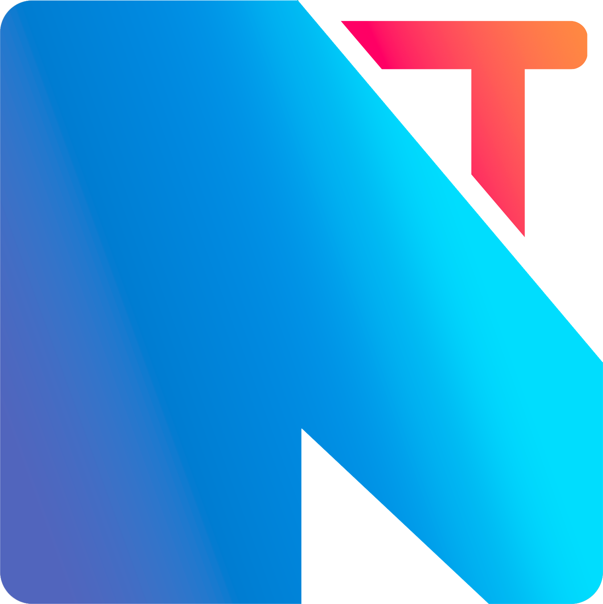

  # FigBranch 📝  
  In this branch I will document my process of redoing the visual aspect of NexTech website, aiming to bring former team member Pol’s Figma design to life.

- [@Takkun](https://github.com/MoonRodri)  
   

  
## Why tho ❓  
  When I joined NexTech, my teammates showed me Pol's website design, since he left, his design had not been fully implemented in the project, so my teammates assigned me the task of doing it.
  
  # Members of the group 🏆  
  - [@Rorro101004](https://github.com/Rorro101004)  
  - [@Joan Ye](https://github.com/Joan735)  
  - [@Takkun](https://github.com/MoonRodri)  
   

